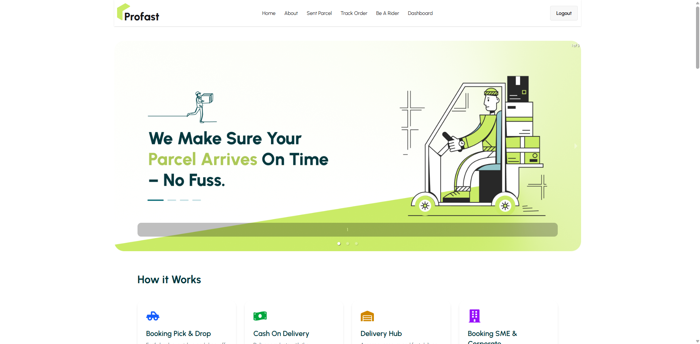
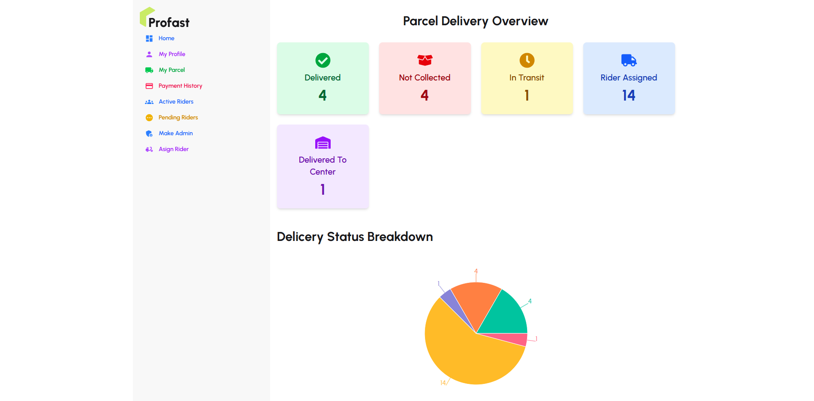
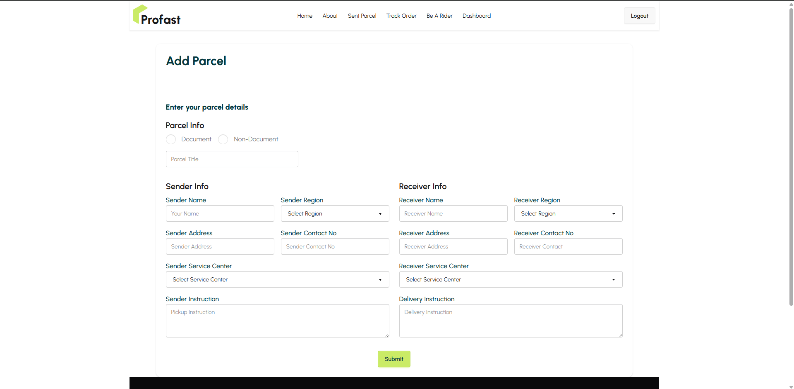
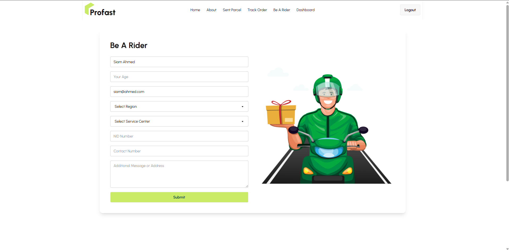
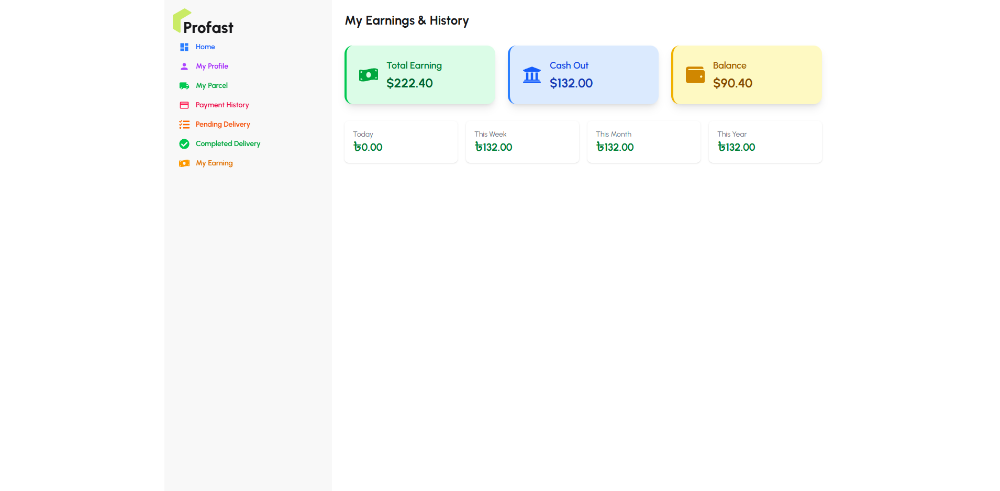

# 📦 Parcel Delivery Management System

A full-stack parcel delivery management system where users can create parcels, riders can manage deliveries, and admins can track the overall system efficiently.

🔗 **Live Website**: [Visit Live Site](https://email-pass-auth-12a30.web.app/)

---

## 🚀 Features

### 🧑‍💼 Admin Panel
- Dashboard with delivery status overview
- Manage riders (approve/reject)
- View all users and parcels
- Track payments and cashouts
- View parcel tracking logs

### 👤 User Functionality
- Register/Login (Email & Password)
- Create and track parcels
- View parcel delivery progress
- Pay for delivery (Stripe integrated)
- See parcel history and payment info

### 🚴‍♂️ Rider Panel
- Accept/Reject delivery requests
- View assigned parcels
- Mark parcel as picked/delivered
- View earnings & request cashout
- Delivery history and performance metrics

---

## 🛠️ Tech Stack

### Frontend:
- **React.js**
- **React Router DOM**
- **Tailwind CSS + DaisyUI**
- **React Icons**
- **Axios**
- **TanStack React Query**
- **SweetAlert2**

### Backend:
- **Node.js**
- **Express.js**
- **MongoDB**
- **Firebase Authentication**
- **Stripe Payment Gateway**

---

## 🔐 Authentication & Authorization

- Firebase for authentication (login/register)
- Role-based access control: **Admin**, **Rider**, and **User**
- Protected Routes (with custom hooks)
- JWT token-based secure API requests

---

## 📦 Parcel Flow Chart

1. User creates parcel
2. Admin assigns a rider
3. Rider picks up and delivers
4. Delivery status gets updated
5. Payment and cashout processed

---

## 💳 Payment & Earning

- Stripe integrated for secure payments
- Riders earn money per delivery:
  - **Same Region**: 30% or 40%
  - **Different Region**: 20%
- Riders can view earnings and cashout

---

## 📈 Admin Dashboard

- Status summary cards
- Rider & user management
- Parcel tracking by ID
- View total earnings and delivery stats
- Pie Chart view of delivery statuses

---

### 🖼️ Screenshots

#### 🔹 Banner

#### 🔹 Admin Dashboard

#### 🔹 User Parcel Form

#### 🔹 Be a Rider Form

#### 🔹 Rider Earnings

### Install dependencies
npm install

### Run the development server
npm run dev